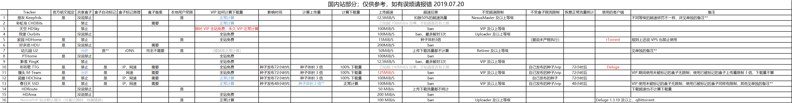

# PT实用工具&脚本分享

# 前言

不止不觉入坑快一年了，我已经忘记了当初注册蒲公英的目的是啥，但是无非就是想快速下东西、想看电影罢了。一年花在PT上的时间也蛮多的，或许也是一种逃避？

当初小白的时候总是能问出各种各样的沙雕问题，还好当初的前辈都很和蔼，至少不像我一样暴躁，感谢就不写在这了，本文主要是一个个人认为有价值的脚本&知识的一个收录合集，希望后来者能少走点弯路。

Attention：如果你是个大佬，应该不会在本文中看到什么出彩的东西，全都是抄的或者干脆丢了个链接。

PS：本人又懒又喜欢废话，还喜欢说一些错的东西，希望有大佬看到哪里错了可以说一下。

# 盒子篇

## 盒子（seedbox）是什么

个人理解盒子是一类用于进行PT/BT下载的远程服务器。

盒子主要类型，从IP情况来说分为：共享盒子和非共享，前者主要是一些专业seedbox提供商，例如SeedHost、Feral Hosting等，后者例如hetzner等独立服务器提供商。

## 盒子的选购：

### 盒子的选择：

这方面收到时间限制较为大，而且我用的也不是很多，就随便说一点了

在挑选的过程中，你需要先明确几个问题：

1.预算 2.需要刷什么站 3.打算刷多少 4.有没有自己购买的能力（Visa 或者Master信用卡）

内站由于一些seedbox的限制（不能超过100M/S、部分站点不可使用共享盒）无法使用共享盒。

具体可以参考[@Aniverse](https://github.com/Aniverse)收集的盒子限制表如下



独立服务器（杜甫）

比较常见的盒子有oneprovider的各价位机型、hetzner的拍卖机、online的特价机，

[oneprovider](https://oneprovider.com/dedicated-servers/1gbps) 下文简称其为op。个人点评：客服回复速度较慢，机子容易出问题，提供的系统镜像版本少且版本较老，低价位可以考虑购买。退款较难。

[hetzner](https://www.hetzner.com/)：其普通机器在非活动期间有安装费且费用较高（34欧元）起步，属于中高档机器，而大部分人购买的是其[拍卖机](https://www.hetzner.com/sb)，拍卖机价格浮动，有的时候可以遇到比较好的传家宝机器，其后台支持机器转让，因此在hostloc上有不少人转手机器赚取差价。机器使用不满14天可以无条件退款，请勿滥用，可能导致封号。

[online](https://www.online.net/)：著名奸商，需要注意其活动有效时间等，客服服务比op好一点，偶尔有特价机。

共享盒子：

[Seedhost](https://www.seedhost.eu/)：流量少，盘一般大，刷力尚可，超过流量上限后限速至100mbps，提供安装rt de，起步6欧元，这家其实也有提供杜甫出租，但是常年无货。其SSD机器据说刷力不错，外站经常见到。

[Feral Hosting](https://www.feralhosting.com/)：不限流，机子看脸，运气好可以跑得很快，起步10英镑。

[ultraseedbox](https://ultraseedbox.com/)：有限流与不限流的机器可供选择，买过一个5欧元的小鸡，体验尚可，小鸡流量太少了。其SSD机型盘较小但是流量给的几乎是SH相似价位的两倍。刷外站可以选购

保种鸡：

由于大部分保种鸡需求和上述两者不同，保种鸡只要能一直开机盘体积大就行，性能是不需要考虑的(x)

[SoYouStart](https://www.soyoustart.com/): 主要是选购他家的arm机器，可以参考B大的[购买与配置指南](https://blog.mabors.com/archives/armstorage.html)

一些大盘VPS：注意此处雷区还是比较多的，有些one-man idc 例如hostsolution 之类的就不要去送人头了

### 盒子的购买：

仅列举几个自己购买过的

VISA&Master信用卡：全部

支持pp：hetzner、oneprovider、seedhost、ultraseedbox、

支持支付宝&微信：oneprovider

其中hetzner新账号注册需要验证，你可以选择pp支付20欧元，或者提交身份证明，例如身份证+信用卡背面（记得遮挡CVV码），或者护照、驾照、具体抄了一下盒子群的bot

①拍卖页面购买的机器不会立即生成账单，14天以内取消机器算免费试用，但不要多次尝试，账号会被封！

②账号注册后需要验证身份，会收到一封要求验证身份的邮件，将身份证或者护照和信用卡放在一起拍照片发过去，为了安全可以适当打码并且用证件水印助手APP处理下

③也可以直接付款20欧让账号生效,但也不是百分百靠谱，可能仍然需要验证，付的20欧作为余额可以在购买机器时消费,如果收到如下邮件等个10分钟左右可能就成功了，否则会继续收到需要验证身份信息
https://pic.ymgblog.com/images/2019/06/23/e3a42dd6acefaf3f3e70200ee1e88440.png

④购买机器时如果费用带税可以按下图设置 https://pic.ymgblog.com/images/2019/06/23/b1000f5014824ee249ebfd8cf48b0d2b.png

找人代购盒子的注意事项：

 有能力自己买就不推荐代购

Feral hosting：仅信用卡

## 盒子的安装：

### 共享盒子RSS：

由于有些共享盒子没有提供flexget安装选项，而且几乎所有共享盒子都提供了rTorrent+RuTorrent的组合，你可以直接使用组合自带的RSS功能进行RSS。

1.首先在rut中添加RSS订阅


2.设置RSS自动下载规则


这里的规则你可以自己写 怎么写清自行百度 我图上的规则意思是全部下载 并且不会自动在rt中自动开始下载。

3.设置deluge监听目录到 `/home36/yezi/.config/.session`

4.修改rt的RSS更新频率，在webui中仅能设置到2min，修改文件可以修改到1min

 修改文件使得更新频率到1min方法:

 `/home36/yezi/www/yezi.gold.seedhost.eu/yezi/rutorrent/plugins/rss/conf.php`

 `$minInterval = 1; // in minutes`

### seedhost deluge刷新tracker脚本

https://www.seedhost.eu/whmcs/knowledgebase/266/Deluge-update-tracker-script.html

### 连接服务器：

用法是使用putty或者xshell等连接上你的服务器，具体如何连接不赘述了，可以参考 https://jingyan.baidu.com/article/ed2a5d1f6b31af09f7be1748.html 等之类的教程。

### 限制同时进行下载的任务数：

考虑到有的时候我们需要进行全站RSS，这个时候可能对我们的盒子性能有比较高的要求，我们观察后可以通过限制同时下载任务数稍微提升一点表现，但是由于目前删种的条件较难以控制，属于中下解。。。但也不是不能用。

qb+autoremove-torrents：

 设置当前最大任务数，所以同时加进去的种子会进入排队状态，而使用autoremove-torrents每分钟检查并且移除排队种子。如果对应站点有不少的低速种子可以在qb里设置若干速度以下排除排队。

随便写的一个配置文件 没上机测试过

```
noob:
  client: qbittorrent
  host: http://127.0.0.1:2017
  username: admin
  password: adminadmin
  strategies:
    remove-queued:
      status: queued
      remove: ratio < 1
    avoid-boom:
      seed_size: 
        limit: 6500
        action: remove-old-seeds
  delete_data: true
```

移除所有排队的 ratio小于1的种子（默认顺序是先加入的在队头

并且在所有种子的size大于6500GiB的时候开始移除老种子

### 软件安装：

这部分 个人认为一般的刷子完全可以仅依赖星大的脚本: https://github.com/Aniverse/inexistence

此时还可以大喊efs牛逼！ https://github.com/amefs/quickbox-lite

这两者的对比，前者更齐全，制种、发种工具一应俱全，后者有一个统一的WEBUI界面，而且大部分操作（卸载、安装、重启）可以在webui执行。

星大脚本：

 在shell中输入

```
bash <(wget --no-check-certificate -qO- https://github.com/Aniverse/inexistence/raw/master/inexistence.sh)
```

回车运行即可，在运行前请仔细阅读GitHub上的readme，例如安装跳检客户端等等均有描述。

例如：


需要提一嘴的是部分机子不提供root用户的登录，需要先使用你在后台设置的用户名密码登入然后使用 `su - root` 进行提权成为root用户，这样的厂商有online.net & oneprovider等

### ipv6：

部分用户可能有这个需求。

online:

 online在账户里有ipv6选项（新账号需要先order一个free ipv6 block) 然后自己分subnet。

oneprovider：

默认不会给ipv6地址块和DUID，需要你新建一个ticket然后和客服交流获取。

和oneprovider客服交流过程举例：


配置ipv6脚本

debian:

 https://github.com/jxzy199306/ipv6_dhclient_online_net

ubuntu:

 https://blog.gloriousdays.pw/2019/03/14/configure-online-net-ipv6-on-ubuntu-18-04/

all:

https://ymgblog.com/2018/03/12/345/

### 服务器运行状态：

综合状态判断：常见指令有atop、htop指令，但是如果需求不是很高而且想要一个好看的图形界面可以使用gotop具体可以参考我的[博文](https://yukino.nl/2019/07/19/Gotop/)

硬盘状态判断：`iostat -dxm 1` 如果是安装了星大脚本的可以直接使用`ios` ，查看最右侧数值为0-100的数值，若较高说明硬盘负载较大

### RSS

由于qbittorrent的webui没有RSS功能，因此RSS要实现的话需要依赖其他软件，例如flexget、rutorrent的RSS功能，[GORSS](https://github.com/capric98/GoRSS)等其他软件实现。

flexget可以由星大脚本（推荐）安装，或是手动安装。

手动安装：参考https://linkthis.me/2018/02/15/the-note-of-using-flexget/

配置文件个人认为星大的配置方法比较容易懂好上手

Link: https://github.com/Aniverse/WiKi/blob/master/Flexget.md

其中deluge和qbittorrent的限速配置不同，均为限制单种上传10000kb/s 下载30000kb/s

```
qbittorrent:
  maxdownspeed: 30000
  maxupspeed: 10000
deluge:
  max_up_speed: 30000
  max_down_speed: 10000
```

至于flexget的定时运行个人推荐Crontab方式，频率不宜过高，flexget每次execute会占用大量硬盘io，很容易出现种子骤然掉速情况。

解决flexget的io占用有两个方式：

1.开一台专门的机器负责flexget，配置不需要太高，普通vps或者你科学上网使用的机器即可。

2.使用[GORSS](https://github.com/capric98/GoRSS) GORSS是由[capriccio](https://capriccio.moe/)开发的使用go编写的rss文件，支持push种子到qb和下载种子deluge的watch folder

2019.10.02更新：

考虑不少人对于这个修改还是不太熟悉，就大致描述一下，一台刚装好星大脚本的机器需要干什么。

1.登录进flexget的webui地址

星大脚本默认是 `your_ip:6566`

修改配置文件中的tasks部分

```
# Here are some guides
#
# https://ymgblog.com/2018/04/30/396/
# https://npchk.info/linux-flexget-rss/
# https://linkthis.me/2018/02/15/the-note-of-using-flexget/
#
# https://github.com/Aniverse/WiKi/blob/master/Flexget.md
# https://github.com/Aniverse/WiKi/blob/master/How.to.use.RSS.md#flexget-rss
#
# For more usages, check the offical site: https://flexget.com

templates:
  freespace:
    free_space:
      path: /home/yezi
      space: 10240
  qb:
    qbittorrent:
      path: /home/yezi/qbittorrent/download/ #默认下载路径
      host: localhost
      port: 2017
      username: yezi
      password: 123456
  tr:
    transmission:
      path: /home/yezi/transmission/download/ #默认下载路径
      host: localhost
      port: 9099
      username: yezi
      password: 123456
  de:
    deluge:
      path: /home/yezi/deluge/download/ #默认下载路径
      host: localhost
      port: 58846
      username: yezi
      password: 123456
  size:
    content_size:
      min: 6000
      max: 666666
      strict: no
tasks:
  tjupt:
    rss: your_link #你的rss_link
    template: #调用上面定义的qb模板
     - qb
    content_size: #300M-4000M体积过滤
     - min: 300
     - max: 4000
    qbittorrent:
      label: tjupt 
      maxupspeed: 50000 #kb/s
    accept_all: yes #接受所有种子
web_server:
  port: 6566
  web_ui: yes
# This is prepared for reverse proxy, do not uncomment it unless you know how it works
# base_url: /flexget

# schedules is disabled by default, you need to enable it or use cron to RSS
schedules: no
```

上面的`templates:`是一些星大脚本自带的模板，一般是不需要进行修改的。

这样改完以后，有可能会rss到一些旧种子，你可以在webui的execute菜单进行如下操作，标记掉旧种子


右侧勾选learn并且点击execute 就会进行第一次运行且标记掉旧种子

2.开启定时运行

假设你运行在了root下，如果不是root下

`sudo su -` 切换到root

在ssh窗口输入 `crontab -e`

默认会有个提示，问你用哪个文本编辑器，直接回车，使用nano

```
# Edit this file to introduce tasks to be run by cron.
#
# Each task to run has to be defined through a single line
# indicating with different fields when the task will be run
# and what command to run for the task
#
# To define the time you can provide concrete values for
# minute (m), hour (h), day of month (dom), month (mon),
# and day of week (dow) or use '*' in these fields (for 'any').#
# Notice that tasks will be started based on the cron's system
# daemon's notion of time and timezones.
#
# Output of the crontab jobs (including errors) is sent through
# email to the user the crontab file belongs to (unless redirected).
#
# For example, you can run a backup of all your user accounts
# at 5 a.m every week with:
# 0 5 * * 1 tar -zcf /var/backups/home.tgz /home/
#
# For more information see the manual pages of crontab(5) and cron(8)
#
# m h  dom mon dow   command
*/2 * * * * /usr/local/bin/flexget --cron execute
```

最下或者其他任何地方加 上面代码块最后一行即可

然后ctrl+x退出编辑，编辑器会提问是否保存，输入Y，回车就保存成功了，过2分钟在ssh里输入

`flexget status`查看flexget运行状态

### Autodl-irssi：

这篇主要是给外站使用的，大部分使用在外站对应的wiki中均有，就不多谈了，配置较为简单，直接在rutorrent的webui中就可以配置，部分站点需要先去irc注册一下你的bot的nick，具体请参考具体站点的WiKi等。

### 文件传输：

星大脚本在安装rt的同时会安装h5ai，h5ai可以用于拖回单文件的情况，使用idm加大进程数可以有效提升拖回速度。

如果是多文件，可以采用sftp的方式拖回，但是sftp对单一文件只会使用单线程，传输较慢。

如果要传输文件至盒子上，也可以使用sftp

当然可以使用网盘（onedrive或者google drive进行中转）具体实现可以google rclone

例如：


### 优化：

我也不会，不要问我。

### 自动移除种子及其数据：

我很懒，我不想手动删种，我想要程序自动删除某些符合条件的种子。

方案有两种

 1.使用qbittorrent+[autoremove-torrents](https://github.com/jerrymakesjelly/autoremove-torrents)

 2.使用deluge+[autoremoveplus](https://github.com/omaralvarez/deluge-autoremoveplus)

前者的使用文档十分详细，且有中文，本文不复读了。

后者的话是deluge的一个插件，星大脚本默认是安装了但是没启用，可以在deluge的webui 设置里勾选此插件，配置还是比较丰富的。


我解释一下上图的配置文件，

check every： 每T天检查一次 0.0416为大约一小时

Max.Torrents: 当deluge有N个种子时进行check ，0为无视当前有多少个种

Min.HDD Space：当硬盘剩下M GB 进行check，-1为无视当前有多少空间。

所以结合起来就是，每T天进行一次检查，当且仅当有N个种，硬盘剩下M GB时进行后面对每个种子进行条件判断

条件可以有2条进行组合，比如图上就是移除已做种0.042小时的种子。

examption rules指的是部分类型的种子可以豁免删除

exampted torrents count toward maximun指的是豁免种是否统计在 max torrents里

remove torrents指的是是否移除种子

remove torrent data指的是是否移除种子下载的数据。

结合起来我的示例图是 当硬盘空间小于150G时每小时检查一次并且删除做种时间超过一小时的种及其数据。

### 如何制种：

本人使用盒子制种较少，但是可以依赖星大脚本里的 `zuozhong` 命令制种，获取视频的mediainfo以及截图可以使用`jietu`命令，具体可以参考星大写的readme

### 如何管理客户端（重启等）

使用星大脚本安装且勾选了system tweaks的可以使用`mingling`指令调出脚本菜单，根据菜单指引进行重启或者监视客户端

### 共享盒子想装别的软件：

可以使用星大写的脚本(星大牛逼) https://github.com/Aniverse/iFeral

### ARM盒子如何配置：

配置较低，建议使用tr或者rt，可以参考B大的[安装指南](https://blog.mabors.com/archives/armstorage.html)

### 如何抓取免费种：

https://github.com/Alvinnfly/promotion

https://github.com/Juszoe/flexget-nexusphp

本人未使用过 也不知道怎么用 会不会被ban我也不知道

### Hetzner-RAID0以及安装系统：

https://npchk.info/hetzner-raid0/

### 手动编译安装qbittorrent：

https://npchk.info/ubuntu-debian-install-qbittorrent/

### 开启root用户远程登录：

```
sudo nano /etc/ssh/sshd_config
```

找到`PermitRootLogin` 将其值修改为yes

按ctrl+X保存并关闭文件，按Y确认保存文件，按ENTER退出nano。

重启sshd服务

```
sudo systemctl restart ssh
```

### 一些杂物：

简介生成工具：[PT-GEN](https://github.com/BFDZ/PT-Gen) & [PT-GEN-cfworker](https://github.com/Rhilip/pt-gen-cfworker)

 不想自己部署的话可以使用：https://rhilip.github.io/PT-help/ptgen

 或者我部署的https://yezi.ga/

 注意一些站点要求图片不能使用豆瓣，请自行上传至网站服务器或者图床

 R酱的PT-GEN收录文章：https://blog.rhilip.info/archives/1063/

常用图床：

[http://imagebam.com](http://www.imagebam.com/) 支持纯porn图片 自动生成缩略图

https://imgbox.com/

https://pixhost.to/ 支持porn

感谢观看 & Thanks for everyone

来源：https://yukino.nl/2019/08/10/pt-tools/